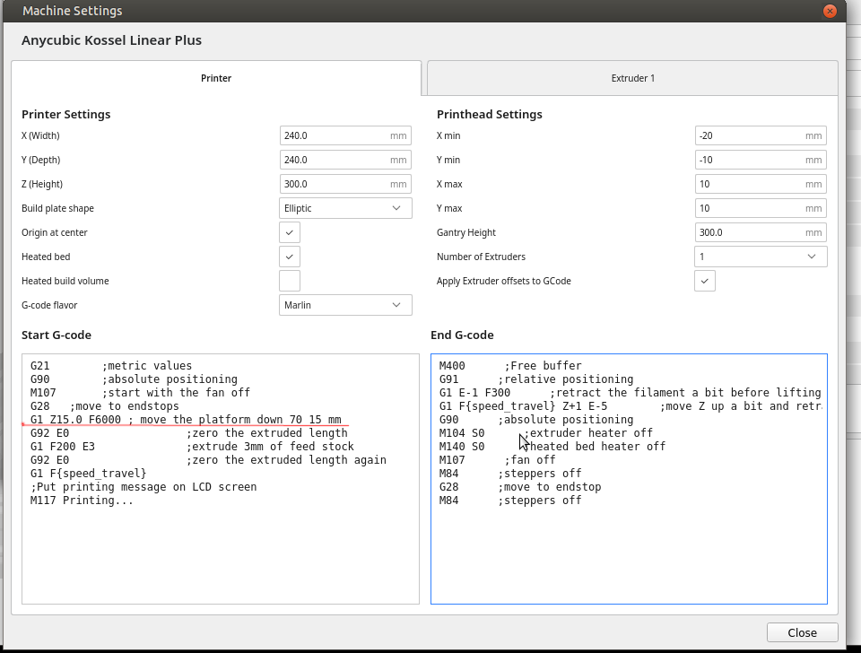
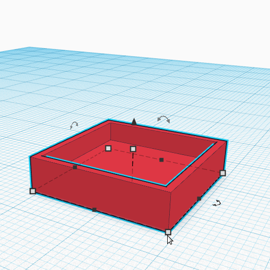
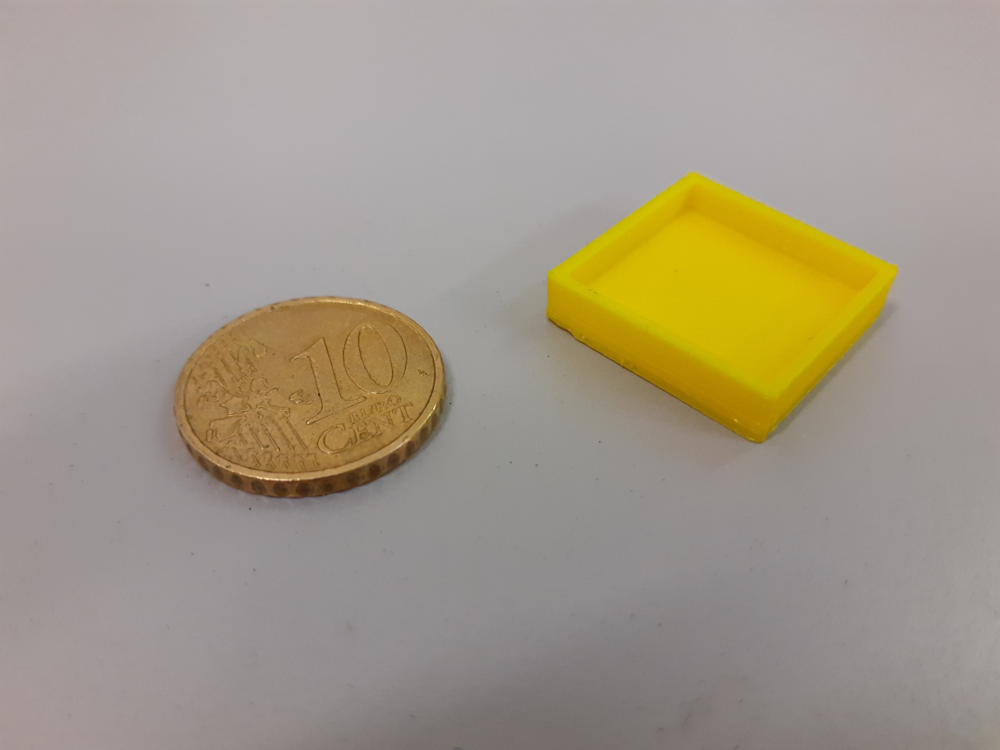

# 3D printing

This page describes the 3d printers and settings used in our lab at [Institute of Cognitive Sciences and Technologies, National Research Council of Italy](https://www.istc.cnr.it).
 
3D printers:

* Anycubic Kossel Linear Plus
* Prusa i3 MK3S+

## Software and settings Anycubic Kossel 

Ultimaker [Cura 4.11](https://ultimaker.com/software/ultimaker-cura), tested on:

* Ubuntu 20.04. Download the ** "Linux 64 bit, AppImage" ** (and make it executable!).
* Windows (to be tested)
* Mac (to be tested)

Once installed, configure the software selecting the <em>Anycubik Kossel Linear Plus</em>  in the list of available 3d printers. 

### G-Code settings

All default settings are correct.
Please, note that we the added the following line to the default start g-code:
> G1 Z15.0 F6000 ;Move the platform down to 15mm

See the figure for the correct reference. This line makes the extruder stop for a little while at 1.5 cm from bed, before starting the printing. This was done for safety reason, to be sure that the print bed position is correctly detected. 

### Materials settings

* PLA
    * extruder temperature: 200 degree
    * bed temperature 60: degree
    * velocity: 60 mm

### Print test

Little empty box 20x20x5 mm, thickness 1 mm.
File [test_anycubic.stl](example_files/test_anycubic.stl), made on [Tinkercad](https://www.tinkercad.com).

## Software and settings Prusa i3 MK3S+

Prusa Slicer [Slicer 2.4.1] https://www.prusa3d.com/it/pagina/prusaslicer_424/ tested on:

* Windows 
* Ubuntu 20.04. Download the ** "Linux 64 bit, AppImage" ** (and make it executable!).
* Mac (to be tested)

Once installed, configure the software selecting the <em>Original Prusa i3 MK3S e MK3S+</em>  in the list of available 3d printers. 

### G-Code settings

All default settings are correct.
You can select the filament type (e.g. PLA) and the print settings (Speed VS Qality and filament thickness)

### Materials settings

* PLA 
    * extruder temperature: 200 degree
    * bed temperature 60: degree
    * velocity: 60 mm

### Print test

Little empty box 20x20x5 mm, thickness 1 mm.
File [test_anycubic.stl](example_files/test_anycubic.stl), made on [Tinkercad](https://www.tinkercad.com).

